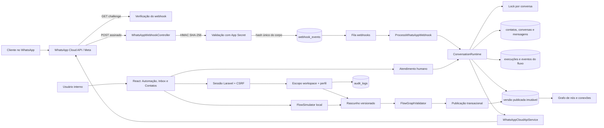
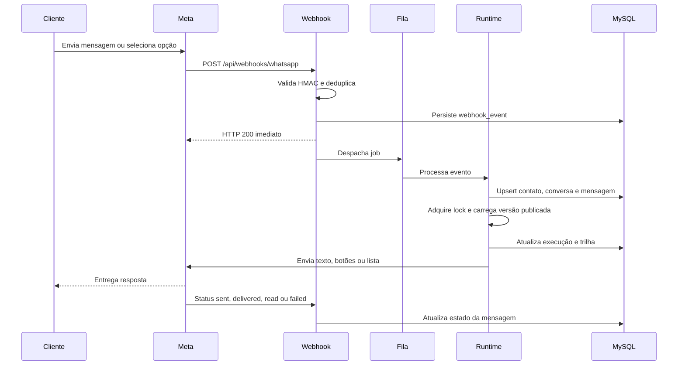

# Arquitetura do MaissFlow

## Visão completa

## Decisões arquiteturais

### Um monólito modular é a melhor primeira etapa

O volume e o domínio ainda não justificam microsserviços. Laravel concentra
autenticação, editor, runtime e inbox, enquanto a fila separa o trabalho
assíncrono e mantém a resposta do webhook rápida. Os limites internos são
explícitos em serviços, jobs e modelos, permitindo extrair o runtime no futuro
sem antecipar custo operacional.

### Rascunho mutável, publicação imutável

`automations` representa a identidade da automação. Cada alteração ocorre em uma
linha `automation_versions` com status `draft`. Ao publicar:

1. a automação é bloqueada com `SELECT ... FOR UPDATE`;
2. a revisão esperada é conferida;
3. o grafo é novamente validado;
4. a publicação anterior é arquivada;
5. o rascunho torna-se `published`;
6. um novo rascunho é criado.

Conversas em andamento continuam presas à versão em que começaram. Assim, editar
um menu não muda o caminho de um cliente no meio do atendimento.

### Controle de concorrência

O editor envia `expected_revision`. Se outro operador salvar primeiro, a API
retorna HTTP 409 em vez de sobrescrever silenciosamente o trabalho. No runtime,
um lock por conversa impede duas mensagens simultâneas de avançarem o mesmo
fluxo duas vezes.

### Idempotência em duas camadas

- `webhook_events.event_id` guarda o SHA-256 do corpo recebido;
- `messages.meta_message_id` é único.

Reentregas da Meta são aceitas sem duplicar mensagens nem reiniciar fluxos.

### Segurança

- `access_token`, `app_secret` e `verify_token` usam cast `encrypted`;
- nenhum segredo é serializado de volta à interface;
- o `POST` do webhook exige `X-Hub-Signature-256` válido;
- autenticação interna usa sessão, CSRF e limitação de tentativas;
- todas as consultas administrativas são limitadas ao `workspace_id`;
- publicação e credenciais exigem perfil de gestor;
- alterações relevantes geram `audit_logs`;
- o runtime usa apenas a versão publicada, nunca um rascunho.

Em produção, segredos devem preferencialmente vir de um cofre externo. A
criptografia do Laravel depende de `APP_KEY`; perder ou trocar essa chave sem
rotação planejada torna os segredos persistidos ilegíveis.

## Modelo de dados

| Tabela | Responsabilidade | Integridade principal |
|---|---|---|
| `workspaces` | empresa proprietária dos dados | `slug` único |
| `users` | operadores internos | vínculo obrigatório ao workspace |
| `whatsapp_channels` | número, WABA e credenciais criptografadas | número da Meta único |
| `automations` | identidade e estado da automação | versão publicada referenciada |
| `automation_versions` | snapshots do grafo | versão única por automação |
| `contacts` | identidade do cliente no WhatsApp | `workspace_id + wa_id` único |
| `conversations` | sessão de atendimento bot/humano | canal + contato único |
| `messages` | mensagens inbound/outbound e status | `meta_message_id` único |
| `flow_executions` | execução presa a uma versão | estado e nó corrente indexados |
| `flow_execution_events` | trilha detalhada de cada nó | vínculo à execução |
| `webhook_events` | caixa de entrada idempotente | hash do evento único |
| `audit_logs` | rastreabilidade administrativa | ator, alvo, antes/depois |

## Fluxo de uma mensagem

## Extensão segura do motor

Os tipos `condition`, `action`, `input` e `delay` pertencem ao contrato do grafo
e ao editor, mas integrações arbitrárias não são executadas sem uma allowlist.

Nós `input` coletam texto livre, validam a resposta (`text`, `cpf`, `email`,
`telefone`, `opcao`), guardam o valor em `flow_executions.context.variables`
pelo nome em `variable` e reaplicam a pergunta quando a validação falha.
Respostas podem ser referenciadas em mensagens com `{{flow.variavel}}` e nos
atributos do contato com `{{contact.campo}}`. Menus podem persistir a opção
escolhida em `saveTo`.

Nós `action` executam apenas classes registradas no
`App\Services\Actions\ActionRegistry` por identificador (`submit_ouvidoria`).
A classe `OuvidoriaSubmitAction` envia a manifestação ao formulário público do
MAISSDoc (`POST multipart` com `_token` e cookie de sessão obtidos em GET
prévio), extrai `protocolo` e `codigo` da resposta e os grava em
`ouvidoria_protocolo` e `ouvidoria_codigo` do contexto. A configuração vem de
`services.ged.*` (`GED_OUVIDORIA_URL`, `GED_OUVIDORIA_TIMEOUT`) — o grafo nunca
carrega URL, cabeçalhos ou segredos.

A execução registra `input_received`, `action_executed` e `action_failed` em
`flow_execution_events` com entrada, saída resumida e duração. Falhas seguem a
aresta `error` quando existir; caso contrário encerram a execução como
`failed` sem falsamente informar sucesso ao cidadão.

Para novas ações externas:

- implemente `App\Services\Actions\FlowAction` e registre no `ActionRegistry`;
- valide esquema e permissões no momento da publicação;
- execute I/O externo em jobs idempotentes;
- aplique timeout, retry, circuit breaker e mascaramento de segredos;
- grave entrada, saída resumida e duração em `flow_execution_events`;
- nunca aceite PHP, SQL, URL ou cabeçalhos livres vindos do grafo publicado.

## Escalabilidade

Até volumes moderados, MySQL/InnoDB e múltiplos workers atendem bem. Escale os
workers pela profundidade da fila e mantenha afinidade apenas no lock lógico da
conversa. Para bases grandes, prefira paginação por cursor no inbox, arquivamento
de `webhook_events`/eventos antigos e particionamento mensal de mensagens somente
depois de medir o crescimento real.
